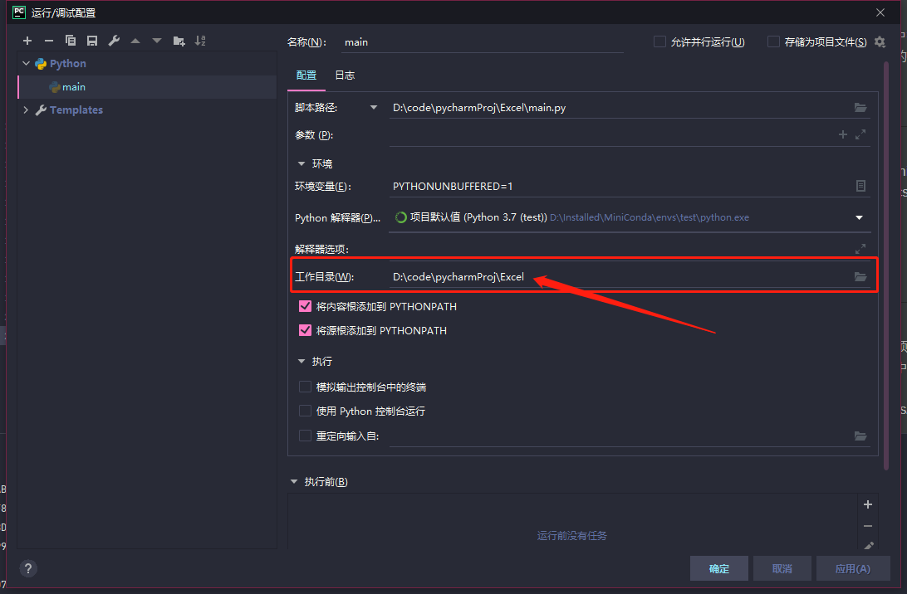

# 杨玲莉交通项目
## 项目要求：
* df1为11点之前的公交乘坐数据
* df2为11点之后公交乘坐数据
* df3为乘坐地铁的数据
* 要求对于df3的每条地铁数据，从df1和df2中找出相同卡号，并且坐公交时间在坐地铁时间之后的数据（找出一行）。
并把转车记录写到新的excel中

## 使用的技术
* 使用python的pandas库
* 杨玲莉给的初始excel在文件夹“yanglingli_initial_excel”中，命名为df1,df2,df3
* pandas 无法处理.xlsx文件,因此,先转换成.csv文件,使用excel手工转换成csv文件,存放在static/csvFile文件夹中
* 手工将df1，df2合并成df4，转换成一张表

## 运行：
* 笔者使用的是pycharm
* 运行前将工作目录转换成项目根目录，(本项目为/Excel)，如图：

 
 
配置pycharm的工作目录

* 将数据文件放在static/initial_excels文件夹中(数据文件在with_initial_excel_file分支)
* 运行文件为：main.py
* 跑完后输出的数据文件存放在static/csvFiles/result.csv中